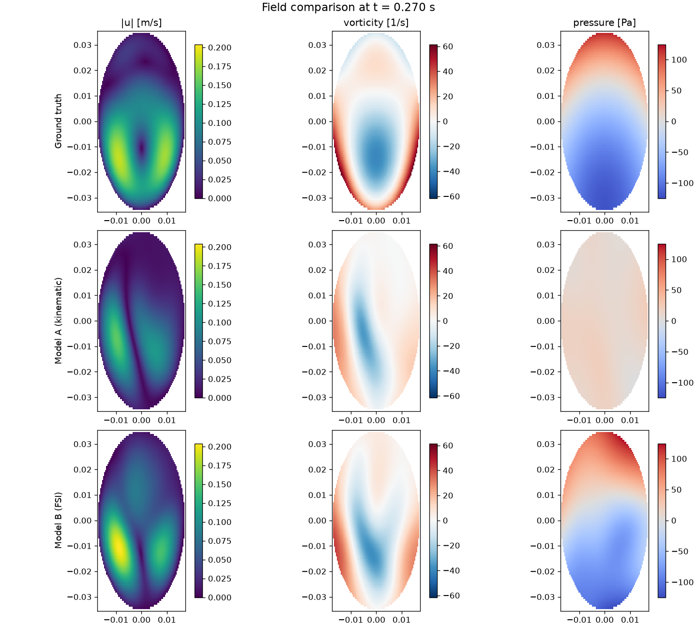

# PINNecho — FSI-Informed PINN for Intraventricular Doppler Flow Reconstruction

**Stage 1 · Synthetic data**

PINNecho is a physics-informed neural network (PINN) that reconstructs the full
2D intraventricular flow field — velocity, pressure, vorticity and blood
residence time — inside the left ventricle (LV) from **sparse, single-component,
Doppler-like** velocity measurements.

Its purpose is to compare two physics backbones and answer one scientific
question:

> Does informing the Navier–Stokes backbone with a cardiac **fluid–structure
> interaction (FSI)** simulation improve recovery of velocity-**gradient**
> quantities (vorticity, wall shear stress) and pressure, compared to the
> generic incompressible Navier–Stokes + kinematic no-slip approach used in the
> existing literature (AI-VFM, iVFM-PINN, CSF-PINN)?

This directly targets a weakness that CSF-PINN (Wong et al. 2025) reported in
their own paper: poor recovery of vorticity and wall shear stress (WSS).

> **Project status.** For a single-page summary of what is implemented, the
> latest results, entry points, test coverage and remaining (data-gated) work,
> see [`docs/PROJECT_STATUS.md`](docs/PROJECT_STATUS.md).

> **Stage 1 scope.** No real patient data or clinical echo access is available
> yet. Everything here runs on **synthetic** data that mimics the output of an
> existing IBAMR/IBFE cardiac FSI pipeline. The synthetic ground truth is
> analytic, divergence-free, satisfies exact no-slip on a moving wall, and has a
> nontrivial pressure field — see [Synthetic ground truth](#synthetic-ground-truth).

---

## The two backbones

Both backbones enforce the **same** incompressible Navier–Stokes momentum
balance,

```
rho (u_t + (u · grad) u) = -grad p + mu * lap u + f
```

and differ only in the body-forcing term `f`:

| | Backbone A — `baseline` | Backbone B — `fsi_informed` |
|---|---|---|
| Momentum forcing `f` | `0` (generic incompressible NS) | FSI body forcing from the IBAMR/IBFE run |
| Wall BC | kinematic no-slip (velocity from moving contour) | FSI wall velocity + optional traction-continuity penalty (`sigma_f·n = t_struct`) |
| Mirrors | AI-VFM, iVFM-PINN, CSF-PINN | proposed method |

The FSI forcing `f` represents the **net effect of myocardial active contraction
and structural coupling** on the fluid — physics that a purely kinematic wall
boundary condition cannot capture. In Stage 1 the two wall velocities coincide
(the synthetic solution has exact no-slip), so the comparison **isolates the
effect of the FSI forcing** in the momentum equation. The wall boundary
condition lives in its own module (`physics/boundary.py`) so a later stage can
diverge the two wall velocities without touching the trainer.

---

## Synthetic ground truth

Because no real IBAMR/IBFE run is available in Stage 1, `data/synthetic_lv.py`
*manufactures* a self-consistent ground-truth flow field on a deforming
elliptical LV cavity:

* **Geometry** — the long/short semi-axes pulsate over the cardiac cycle while
  the 2D cavity **area is held constant**, so the wall motion is genuinely
  divergence-free (2D incompressibility) with no phantom sources.
* **Velocity** `u = u_wall + u_vortex`
  * `u_wall` — the affine, divergence-free wall-following velocity of the
    deforming ellipse (equals the true endocardial velocity at the wall).
  * `u_vortex = curl(psi)` with a stream function `psi = (1 - rho^2)^2 · (…)`
    that vanishes together with its gradient on the wall (`rho` = normalised
    radius, `rho = 1` on the wall). Hence the total field satisfies **exact
    no-slip**: `u = u_wall` on the endocardium.
* **Pressure** — a smooth manufactured field `p` (defined up to a constant).
* **FSI body forcing** `f` — defined as *exactly* the Navier–Stokes momentum
  residual of the manufactured `(u, p)`. By construction `(u, p, f)` satisfy
  incompressible NS **to machine precision** (verified in the test suite).

Every derivative (velocity from the stream function, vorticity, forcing) is
taken with `torch.autograd`, so there is no hand-derived algebra to get wrong.

Key properties (asserted in `tests/test_synthetic_lv.py`):

* `max |div u|`  ≈ 1e-15 (divergence-free)
* `max |u - u_wall|` at the wall ≈ 1e-16 (exact no-slip)
* momentum residual with the correct `f` ≈ 0 (NS-exact)

### Virtual Doppler acquisition

`data/doppler.py` emulates a color/PW-Doppler acquisition: for each sample point
it records only the velocity component **along the beam** (the direction from a
virtual transducer to the point), sampled per frame and corrupted with Gaussian
noise. This single-component, noisy signal is the **only** velocity information
the PINN sees — everything else (the cross-beam velocity component, pressure,
gradients) must be inferred through the physics.

**Multiple acoustic windows.** With a single transducer the beams are nearly
parallel across the cavity, so the cross-beam velocity component is poorly
observable and is left almost entirely to the physics prior. Real
echocardiography combines views (e.g. apical + parasternal); accordingly the
acquisition supports several virtual transducers (`doppler.transducers`). Each
measurement is still single-component, but combining windows at different angles
substantially improves full-field recovery.

---

## Why the FSI backbone should win

Given the sparse single-component data, the reconstruction is under-determined
and the physics residual selects the solution. Because the true field requires
the forcing `f`:

* **Baseline** enforces momentum with `f = 0`, which is inconsistent with the
  true `(u, p)`. In particular its pressure gradient is wrong by exactly the
  missing `f`, and the inconsistent momentum residual biases the velocity
  gradients — degrading pressure, vorticity and WSS.
* **FSI-informed** enforces the *same* momentum equation the ground truth
  satisfies, so data + consistent physics + no-slip pin the solution to the
  truth. This most directly benefits the **pressure** field, which is governed
  entirely by the momentum balance the forcing enters.

---

## Model & training

* **Model.** A plain `tanh` MLP mapping non-dimensional `(x, y, t)` to
  non-dimensional `(u, v, p)`. Smooth activations are used deliberately: the
  headline quantities include velocity *derivatives* (vorticity, WSS), and a
  plain tanh network has smooth, accurate derivatives. Random Fourier features
  are available (`model.fourier_features > 0`) but **off by default** — see
  [Stage-1 findings](#stage-1-findings).
* **Losses.** Relative (dimensionless) Doppler-data misfit and no-slip wall
  misfit, plus non-dimensionalised continuity and momentum residuals.
* **Curriculum.** The physics (continuity + momentum) weights are ramped from 0
  over the first `physics_warmup_frac` of training. At initialisation the PDE
  residuals dwarf the data term and are *both minimised by the trivial `u = 0`
  field*; without the ramp the optimiser collapses to `u = 0` and never fits the
  data. Warming up on data + wall first establishes a non-trivial field.
* **Optimisation.** Adam, followed by an optional full-batch **L-BFGS** polish
  (`train.lbfgs_iters`) that drives the residuals down the last 1–2 orders of
  magnitude.

---

## Repository structure

```
PINNecho01/
├── configs/                     # experiment configs (YAML)
│   ├── default.yaml             #   spec-aligned config: every knob documented
│   ├── baseline.yaml            #   backbone A (Stage-1 demo pipeline)
│   ├── fsi_informed.yaml        #   backbone B (Stage-1 demo pipeline)
│   └── smoke.yaml               #   tiny/fast config for CI & demos
├── src/pinnecho/
│   ├── config.py                # dataclass config + YAML (de)serialisation
│   ├── cli.py                   # generate / train / evaluate / compare entry points
│   ├── pipeline.py              # reusable high-level orchestration
│   ├── evaluate.py              # spec metrics: velocity/pressure/vorticity/Q/WSS/
│   │                            #   residence-time + stagnation + spline baseline
│   ├── data/
│   │   ├── synthetic_lv.py      # synthetic IBAMR/IBFE-like LV FSI ground truth (2D)
│   │   ├── synthetic_lv_3d.py   # 3D volume-preserving ellipsoid ground truth
│   │   ├── doppler.py           # single-component sparse Doppler sampling
│   │   ├── dataset.py           # measurement + collocation + wall point sets
│   │   ├── load_ibfe_output.py  # IBFEFrames + real loader dispatch + synthetic exporters (2D/3D, valve)
│   │   ├── ibfe_io.py           # NPZ + manifest/CSV (+VTK) readers/writers for IBFEFrames
│   │   ├── ibfe_validate.py     # validate_ibfe_frames: contract + physical-sanity checks
│   │   ├── ibfe_dataset.py      # IBFEFrames -> training batches / model / evaluate / train_ibfe
│   │   └── synthesize_doppler.py# canonical Doppler synthesis (sparsity/aliasing/SNR)
│   ├── models/
│   │   ├── mlp.py               # Fourier-feature MLP (Stage-1 demo)
│   │   ├── pinn.py              # (x,y,t) -> (u,v,p), with non-dimensionalisation
│   │   └── mlp_pinn.py          # spec network: multi-scale Fourier + heads u,v,[w],p,c
│   ├── physics/
│   │   ├── operators.py         # autograd grad / div / curl / laplacian / D/Dt
│   │   ├── ns_residual.py       # incompressible NS residual (2D/3D, forcing hook)
│   │   ├── scalar_transport.py  # residence-time passive-scalar residual
│   │   ├── navier_stokes.py     # back-compat alias of ns_residual
│   │   └── boundary.py          # no-slip wall BC residual
│   ├── bc/
│   │   └── boundary_conditions.py  # Model A kinematic (impl); Model B (stubs)
│   ├── train/
│   │   ├── losses.py            # Stage-1 demo losses
│   │   ├── trainer.py           # Stage-1 demo Adam/L-BFGS loop
│   │   ├── composite_loss.py    # spec 6-term loss + PDE-weight annealing
│   │   ├── train.py             # spec training entry + A/B compare + visualize
│   │   ├── train3d.py           # 3D end-to-end toy validation driver
│   │   └── observability.py     # windows/SNR/sparsity sweep harness
│   ├── eval/
│   │   ├── metrics.py           # velocity / pressure / vorticity / WSS errors
│   │   ├── residence_time.py    # Lagrangian blood residence time
│   │   ├── plots.py             # field / loss / comparison figures
│   │   └── visualize.py         # A/B truth panels + cardiac-cycle animation
│   └── utils/                   # seeding, logging
├── scripts/                     # thin CLI wrappers (run without install)
├── tests/                       # pytest suite (fast, small-scale)
│   ├── test_ns_residual_taylor_green.py  # NS residual ~0 on exact solutions
│   └── test_scalar_transport.py          # scalar residual ~0 on exact solutions
├── pyproject.toml
└── requirements.txt
```

### Spec-aligned build status

The modules above marked "spec" implement the detailed physics/architecture
specification incrementally. Current status:

| Component | File | Status |
|---|---|---|
| Incompressible NS residual (2D & 3D) | `physics/ns_residual.py` | **Implemented** + unit-tested (Taylor–Green, Poiseuille) |
| Residence-time scalar transport | `physics/scalar_transport.py` | **Implemented** + unit-tested (advection/diffusion/source) |
| Multi-scale Fourier network (`u,v,[w],p,c`) | `models/mlp_pinn.py` | **Implemented** (σ∈{1,10,100}, tanh/sine, 2D/3D) |
| Composite loss (data/pde/scalar/bc/ic/periodic) + annealing | `train/composite_loss.py` | **Implemented** (data loss is beam-component only) |
| Model A kinematic BC + valve/inflow | `bc/boundary_conditions.py` | **Implemented** |
| Validation metrics + spline baseline | `evaluate.py` | **Implemented** (primitives); end-to-end driver scaffolded |
| Training entry + A/B compare | `train/train.py` | **Implemented**; Model A and Model B validated end-to-end on the toy 2D case |
| Canonical Doppler synthesiser (sparsity/aliasing/SNR) | `data/synthesize_doppler.py` | **Implemented** + tested |
| IBFE interface (`IBFEFrames`) + synthetic exporter | `data/load_ibfe_output.py` | **Implemented** (synthetic path); real file loader is a documented stub |
| Model B (FSI forcing + FSI wall velocity + traction continuity) | `bc/boundary_conditions.py` | **Implemented** + tested; A-vs-B ablation run |

> **Staging.** Per the plan, Model B's traction-matching BC is not begun until
> Model A trains successfully end-to-end on the toy 2D case, and each stage is
> confirmed before the next. The Model B BC helpers exist as clearly-marked
> `NotImplementedError` stubs so the interface is fixed but the ablation stays
> honest.

### Model A end-to-end on the toy case (spec modules)

`scripts/train_model_a.py` trains the baseline backbone on the synthetic-LV toy
case using the spec network + composite loss (no FSI forcing, kinematic no-slip):

```bash
python scripts/train_model_a.py --config configs/baseline.yaml --steps 3000 --lbfgs-iters 300
```

Reference run (dual-window Doppler, plain-tanh 96×5 network, Adam + L-BFGS, CPU,
held-out points across the cycle):

| metric (relative L2, ↓) | Model A |
|---|---|
| speed | 0.447 |
| velocity `u` / `v` | 0.641 / 0.537 |
| vorticity (corr 0.82) | 0.578 |
| wall shear stress (corr 0.65) | 0.506 |
| pressure (corr −0.47) | 1.190 |
| physics-free spline baseline (beam) | 1.059 |

The data loss falls from ~1.0 (trivial `u=0`) to ~0.21, i.e. the network
genuinely fits the sparse **single-component** Doppler and — via the physics —
recovers the unseen cross-beam component and the velocity gradients (vorticity /
WSS correlations 0.65–0.82). Pressure is poorly recovered by the baseline
(`f = 0` momentum ⇒ wrong pressure gradient): this is exactly the weakness the
**FSI-informed Model B** is designed to address.

### Model A vs Model B — the ablation

`scripts/compare_models_ab.py` trains **both** backbones from the **same
initialisation** on the **same** data with an **identical network**, so the only
differences are the FSI momentum forcing, the FSI wall-velocity BC, and
(optionally) the traction-continuity penalty:

```bash
# core hypothesis: FSI momentum forcing + FSI wall velocity
python scripts/compare_models_ab.py --config configs/baseline.yaml --steps 3000 --lbfgs-iters 300
# add the traction-continuity BC to Model B
python scripts/compare_models_ab.py --config configs/baseline.yaml --steps 3000 --lbfgs-iters 300 --traction
```

Reference runs (identical arch/data/init; relative L2 unless noted; **↓** = lower
is better, **↑** = higher is better):

| metric | Model A | Model B (forcing) | Model B (forcing + traction) |
|---|---|---|---|
| speed ↓ | 0.456 | 0.454 | 0.452 |
| velocity `u` ↓ | 0.681 | 0.650 | 0.659 |
| velocity `v` ↓ | 0.524 | 0.512 | 0.494 |
| **vorticity** ↓ (corr ↑) | 0.585 (0.81) | 0.561 (0.83) | **0.549 (0.84)** |
| **wall shear stress** ↓ (corr ↑) | 0.516 (0.67) | 0.489 (0.69) | **0.487 (0.68)** |
| **pressure** ↓ (corr ↑) | 0.827 (0.67) | 2.209 (0.79) | **0.105 (0.996)** |

**Reading the result (and an important caveat).**
* **FSI forcing alone** improves the velocity-**gradient** quantities this project
  targets (vorticity, WSS) and the pressure **correlation**, but its pressure
  **magnitude** degrades (relL2 0.83 → 2.21).
* **Adding the traction-continuity BC** appears to resolve this, with Model B
  winning on pressure (relL2 **0.827 → 0.105**, corr **0.67 → 0.996**).

> [!WARNING]
> **This headline pressure result does NOT yet support "FSI helps."** Two
> confounds were identified and quantified in follow-up control ablations
> ([`docs/ABLATIONS.md`](docs/ABLATIONS.md)):
>
> 1. **Circularity.** The synthetic ground truth is a *manufactured* solution, so
>    the traction handed to Model B is `−p·n + viscous` built from the same
>    analytic pressure. Feeding it as a BC injects the wall pressure almost
>    verbatim, making near-perfect pressure recovery close to tautological.
> 2. **Asymmetric boundary info.** In this table A used a *noisy* wall while
>    B used the exact wall.
>
> With **matched exact walls** (3-seed control), pressure recovery is driven
> *entirely by the traction constraint*, not the physics forcing: forcing-only
> gives pressure corr 0.64 but relL2 **3.9** (unusable magnitude), while
> corr 0.986 only appears once traction injects `p·n`. The vorticity/WSS gain
> from the pure forcing term is small (~+0.02–0.04 correlation, within seed
> scatter), and much of the originally-large WSS improvement was the removed
> wall-tracking noise. See [`docs/ABLATIONS.md`](docs/ABLATIONS.md) for the full
> tables, the traction-perturbation stress test, and the recommended redesign
> (pressure-independent active-contraction forcing).
>
> Run it yourself:
> ```bash
> python -m pinnecho.train.ablation --which all --seeds 0 1 2 --windows 1 2 3 \
>     --steps 2500 --lbfgs-iters 200 --dtype float32 --out artifacts/ablations.json
> ```

**The more robust question that replaces it — observability vs. physics.** Two
further ablations reframe the result into something non-circular and clinically
meaningful (full analysis in [`docs/ABLATIONS.md`](docs/ABLATIONS.md)):

* **Pressure is downstream of observability, not the missing physics term.** With
  the baseline (no FSI) and an exact wall, going from 1→3 acoustic windows
  improves the cross-beam velocity `u` (relL2 0.96→0.67) *and* pressure
  correlation (−0.04→0.30) together (coupling −0.67). The `A_exact` pressure
  failure is inherited from the unobserved cross-beam velocity.
* **FSI physics and extra windows fix *different* bottlenecks.** A second acoustic
  window dominates for the velocity field (forcing cannot substitute), but for the
  **gradient** quantities a single window **+ FSI forcing beats two windows without
  it**. This gradient advantage is *not* a vorticity analogue of the pressure
  circularity: the viscous term `−μ∇²u = μ∇×ω` is only **0.23 %** of the forcing
  magnitude (cardiac flow is inertia-dominated), so `corr(f, μ∇×ω) ≈ 0` — the
  forcing does not inject vorticity. A **forcing-uncertainty stress test** (up to
  30 % perturbation) leaves the gradient advantage intact, and per-seed **paired
  stats** make it statistically significant for **WSS** (Δcorr +0.098, t = 5.09,
  3/3 seeds) though only a **trend** for vorticity (t = 1.53). Defensible framing:
  *FSI priors don't replace an acoustic window in general, but for wall shear
  stress they significantly do (non-circular, robust to forcing error); the two
  approaches are complementary.*

Raw numbers: [`docs/results/compare_ab_forcing.json`](docs/results/compare_ab_forcing.json),
[`docs/results/compare_ab_traction.json`](docs/results/compare_ab_traction.json),
control ablations [`docs/results/ablations_all.json`](docs/results/ablations_all.json)
(Check 0 + Ablations 1–4), [`docs/results/ablation5.json`](docs/results/ablation5.json)
(forcing stress test + paired stats), and [`docs/results/ablations.json`](docs/results/ablations.json).

> The table above uses a *coincident* wall velocity for A and B, so it isolates
> the effect of the momentum forcing alone. Stage 2 (below) makes the wall
> velocities realistically differ.

---

## Stage 2 — realistic acquisition, diverged wall, real-data-ready interface

Stage 2 upgrades the framework toward real IBAMR/IBFE data (which is supplied
separately) and makes the two backbones differ in a physically realistic way:

1. **Diverged wall velocity (FSI vs kinematic).** In a real study the FSI solver's
   structural interface velocity is accurate, while Model A's *kinematic* wall
   velocity comes from finite-differencing tracked/segmented contours and carries
   a systematic under-estimation + noise. `build_toy_dataset` now stores both:
   Model B is given the accurate FSI wall velocity, Model A the tracking estimate.
   This is exactly where a near-wall quantity like WSS should reward the FSI
   backbone.
2. **Canonical Doppler synthesiser** (`data/synthesize_doppler.py`): multi-window
   beam projection, a sparsity mask (acquisition gaps), aliasing wraparound at a
   configurable Nyquist limit (with an optional dealiasing toggle), and additive
   Gaussian noise at a configurable **SNR (dB)**. Unit-tested for projection,
   wrap/unwrap, sparsity fraction and SNR level.
3. **Real-data-ready IBFE interface** (`data/load_ibfe_output.py`):
   `synthetic_ibfe_frames(...)` returns the same `IBFEFrames` bundle (fluid
   volume, interface velocity/traction, body forcing, metadata) that the real
   `load_ibfe_output` will, so downstream code is developed/tested against the
   final interface today and the real loader drops in later.

### A-vs-B with the diverged wall velocity

Same identical-architecture/data/init protocol; Model A now uses the kinematic
(tracking-error) wall BC, Model B the accurate FSI wall BC:

| metric | Model A | Model B (forcing + FSI wall) | Model B (+ traction) |
|---|---|---|---|
| speed ↓ | 0.481 | 0.454 | 0.452 |
| **vorticity** ↓ (corr ↑) | 0.585 (0.81) | 0.561 (0.83) | **0.549 (0.84)** |
| **wall shear stress** ↓ (corr ↑) | 0.618 (0.61) | 0.489 (0.69) | **0.487 (0.68)** |
| **pressure** ↓ (corr ↑) | 0.971 (0.24) | 2.209 (0.79) | **0.105 (0.996)** |

**What changed vs the coincident-wall table.** With a realistic kinematic wall
error, the WSS gap widens sharply — Model B improves WSS by **~21%**
(0.618 → 0.489) instead of ~5% — because WSS is a wall-gradient quantity and B
sees the accurate wall velocity. Vorticity still improves, speed improves, and
(with the traction-continuity BC) pressure is recovered near-exactly
(relL2 0.971 → 0.105, corr 0.24 → 0.996). This is the core Stage-1/2 thesis
demonstrated end-to-end: **informing the PINN with the FSI structural model
improves precisely the velocity-gradient and pressure quantities the kinematic
baseline handles worst.**

Raw numbers: [`docs/results/stage2_forcing.json`](docs/results/stage2_forcing.json),
[`docs/results/stage2_traction.json`](docs/results/stage2_traction.json).

Reproduce:

```bash
python scripts/compare_models_ab.py --config configs/baseline.yaml --steps 3000 --lbfgs-iters 300            # forcing + FSI wall
python scripts/compare_models_ab.py --config configs/baseline.yaml --steps 3000 --lbfgs-iters 300 --traction # + traction continuity
```

---

## Visualization, observability sweep, and 3D

Three tooling/validation additions make the results tangible and probe the
remaining bottleneck.

### A-vs-B visualization

`scripts/visualize_ab.py` (console script `pinnecho-visualize`) trains both
backbones from the same initialisation, saves checkpoints, and renders:

* **truth / Model-A / Model-B field panels** for speed, vorticity and pressure
  (shared per-column colour scales), and
* **cardiac-cycle animations** (GIF) of speed and vorticity.

```bash
python scripts/visualize_ab.py --dtype float32 --steps 1800 --lbfgs-iters 200 \
    --traction --out docs/results/ab_viz
```



The panel makes the ablation legible at a glance: Model B recovers the vertical
**pressure gradient** and the interior **vorticity** structure that the kinematic
baseline washes out (baseline pressure is nearly flat; corr 0.24 → 0.98 in this
run). Artifacts: [`docs/results/ab_viz/`](docs/results/ab_viz) —
`fields_t0.30.png`, `fields_t0.60.png`, `metric_bars.png`,
`cycle_speed.gif`, `cycle_vorticity.gif`, and the two `model_*.pt` checkpoints.
Checkpoints load with `PINNNet.from_checkpoint(path)`.

### Observability sweep

`scripts/observability_sweep.py` (console script `pinnecho-sweep`) trains a
backbone under a grid of acquisition conditions — number of acoustic **windows**,
measurement **SNR**, and **sparsity** (points/frame) — and reports held-out
reconstruction error, quantifying the single-component observability bottleneck.

```bash
python scripts/observability_sweep.py --dtype float32 --steps 1800 --seeds 0 1 \
    --out docs/results/observability
```

It writes `sweep.json` and per-metric bar charts (`sweep_vel_relL2_speed.png`,
`sweep_vel_relL2_v.png`, `sweep_wss_relL2.png`) under
[`docs/results/observability/`](docs/results/observability).

Reference sweep (Model B, fsi_informed + traction; 1800 Adam + 200 L-BFGS steps,
float32, CPU; relative L2, ↓):

| condition | SNR (dB) | windows | pts/frame | speed | `u` | `v` | vorticity | WSS | pressure |
|---|---|---|---|---|---|---|---|---|---|
| **windows=1** | 26 | 1 | 300 | 0.568 | 0.969 | 0.564 | 0.711 | 0.741 | 0.219 |
| **windows=2** | 26 | 2 | 300 | **0.555** | **0.815** | 0.579 | 0.714 | **0.725** | **0.172** |
| noise=0.02 | 34 | 1 | 300 | 0.569 | 0.972 | 0.563 | 0.715 | 0.744 | 0.221 |
| noise=0.10 | 20 | 1 | 300 | 0.574 | 0.968 | 0.582 | 0.729 | 0.756 | 0.228 |
| points=150 | 26 | 1 | 150 | 0.573 | 0.972 | 0.545 | 0.714 | 0.755 | 0.232 |
| points=600 | 26 | 1 | 600 | 0.562 | 0.972 | 0.564 | 0.721 | 0.743 | 0.229 |

**The dominant lever is angular coverage, not noise or density.** The primary
(apical) window's beam is nearly aligned with `y`, so it observes `v` well
(relL2 0.56) but the cross-beam `u` component barely at all (relL2 **0.97**).
Adding a second, angled window collapses the `u` error to **0.815** and improves
speed, WSS and pressure — whereas varying SNR across 20–34 dB or sampling density
across 150–600 pts/frame changes every metric by only ~1–2%. This quantifies the
single-component **observability bottleneck**: the reconstruction is limited by
*how many directions are measured*, and the physics prior fills the rest.
Raw numbers: [`docs/results/observability/sweep.json`](docs/results/observability/sweep.json).

### 3D end-to-end validation

`data/synthetic_lv_3d.py` extends the manufactured ground truth to a
**volume-preserving ellipsoid** (`rx·ry·rz = const`), with the same construction
principle as 2D: an affine wall-following field plus a divergence-free interior
vortex `u_vortex = grad(env) × a(t)` (with `env = (1−rho²)²`) that vanishes with
its gradient at the wall, so no-slip is exact. Properties asserted in
`tests/test_synthetic_lv_3d.py`:

* `max |div u|` ≈ 1e-15 (divergence-free), volume constant to 1e-14,
* `max |u_vortex|` at the wall ≈ 1e-12 (exact no-slip),
* 3D momentum residual with the correct `f` ≈ 0 (NS-exact).

`scripts/train_model_3d.py` (console script `pinnecho-train-3d`) runs the spec
network (`spatial_dim=3`) + composite loss end-to-end on three-window 3D Doppler:

```bash
python scripts/train_model_3d.py --dtype float32 --backbone fsi_informed --steps 1800
```

This validates that the whole pipeline (dimension-general residuals, network,
loss, trainer) works in 3D: the loss decreases and every field is finite. Full
3D reconstruction *accuracy* is observability- and budget-limited (three beams,
small CPU network) — a short run reaches ~0.8 velocity relL2 — and is a target
for a larger-budget / richer-acquisition run.

### Preparing real IBAMR/IBFE data

The remaining items are all *data-gated* — they need a real IBFE export. The
ingestion pipeline for that data is now built and tested, so plugging in real
data requires **no code changes**, only matching the on-disk contract. See the
step-by-step [**data-preparation guide**](docs/DATA_PREPARATION.md).

* **On-disk formats** (`data/ibfe_io.py`): a single-file **NPZ bundle** or a
  **`manifest.yaml` + per-frame CSV** directory (annotated template:
  [`configs/ibfe_manifest.template.yaml`](configs/ibfe_manifest.template.yaml)),
  plus an optional VTK/Exodus hook (`meshio`). `load_ibfe_output(path)` dispatches
  by path type; `time_range` / `subsample` restrict/thin large meshes.
* **Concrete example**: `python scripts/make_example_ibfe_export.py --dim {2,3}
  [--valve]` writes a filled-in export (both formats) to copy from.
* **Validator** (`data/ibfe_validate.py`): `validate_ibfe_frames(frames)` checks
  shapes, finiteness, unit-length normals, single-cycle time coverage and
  physical-magnitude sanity before training.
* **Training adapter** (`data/ibfe_dataset.py`): `train_ibfe(frames, backbone=…,
  use_traction=…, predict_scalar=…)` feeds the bundle straight into the shared
  network + composite loss (beam-only Doppler data, PDE + FSI forcing, wall/valve
  Dirichlet, traction continuity, residence-time inflow reinit); `evaluate_ibfe`
  reports held-out error. Run it twice (baseline vs fsi_informed) for the A/B
  ablation on real data.
* **3D + valves**: `synthetic_ibfe_frames_3d(...)` and a `with_valve` option on the
  synthetic exporters populate the 3D fields and the **mitral inflow** point set,
  so the 3D and residence-time paths are exercised end-to-end today against the
  exact interface real data will use.

### Deferred to real data / future work

* **Residence-time (scalar) reconstruction** needs a true inflow boundary
  (mitral valve) to reinitialise `c = 0`; the closed, area-preserving synthetic
  cavity has no real inflow. The plumbing is complete and tested (scalar-transport
  residual, `c` head, inflow reinit, and a `with_valve` inflow point set); only a
  real (or open-cavity) mitral inflow field is outstanding.
* **Higher-fidelity 3D** — the 3D path is validated end-to-end (above); reaching
  clinical-grade 3D accuracy needs a larger training budget, richer multi-window
  acquisition, and ultimately a real IBFE 3D ground truth.

---

## Installation

CPU-only is fine (the defaults are tuned to run on a laptop):

```bash
python -m venv .venv && source .venv/bin/activate
pip install torch --index-url https://download.pytorch.org/whl/cpu   # CPU wheel
pip install -e ".[dev,viz]"  # pinnecho + console scripts + pytest + GIF writer
# or, without installing:
pip install -r requirements.txt
```

Console scripts installed with the package: `pinnecho-train-a`,
`pinnecho-compare-ab`, `pinnecho-visualize`, `pinnecho-sweep`,
`pinnecho-train-3d`, `pinnecho-ablation` (spec-aligned toy drivers), alongside
the earlier `pinnecho-generate/train/evaluate/compare`. Continuous integration
(`.github/workflows/ci.yml`) runs the full `pytest` suite on Python 3.10 and
3.11.

---

## Usage

The scripts under `scripts/` work directly from a checkout (they add `src/` to
the path); the equivalent console scripts (`pinnecho-*`) are available after
`pip install -e .`.

### Quick smoke run (seconds)

```bash
python scripts/compare_backbones.py --config configs/smoke.yaml --out outputs/smoke --iterations 300
```

### Generate a dataset

```bash
python scripts/generate_data.py --config configs/baseline.yaml --out data/generated/dataset.npz
```

### Train a single backbone

```bash
python scripts/train.py --config configs/fsi_informed.yaml --out outputs/fsi
python scripts/train.py --config configs/baseline.yaml     --out outputs/baseline
```

### Evaluate a checkpoint (with field plots)

```bash
python scripts/evaluate.py --checkpoint outputs/fsi/model.pt --out outputs/fsi/eval --plot
```

### Compare both backbones on identical data (the headline experiment)

```bash
python scripts/compare_backbones.py --config configs/baseline.yaml --out outputs/compare
```

This trains **both** backbones from the same initialisation on the **same**
dataset, evaluates every metric, prints a comparison table, and writes
`comparison.json`, `comparison.txt`, `loss_curves.png` and
`metric_comparison.png`.

---

## Metrics

All errors are relative L2 (lower is better), computed against the analytic
ground truth over interior points across the cardiac cycle:

| metric | quantity | derivative order |
|---|---|---|
| `rel_l2_speed` | velocity magnitude | 0 |
| `rel_l2_pressure` | pressure (mean-removed) | — |
| `rel_l2_vorticity` | out-of-plane vorticity `dv/dx − du/dy` | 1st |
| `rel_l2_wss` | wall shear stress vector on the endocardium | 1st |
| `rel_l2_residence_time` | Lagrangian blood residence-time map | integral |

The gradient-order and integral quantities (vorticity, WSS, residence time) are
exactly the ones the baseline literature struggles with and that the FSI-informed
backbone is designed to improve.

---

## Configuration

Every experiment is fully described by a single YAML file mapped onto the
dataclasses in `config.py`. Anything omitted falls back to documented defaults.
CLI flags `--backbone`, `--iterations`, `--seed` override the file. To sweep how
strongly the FSI forcing is trusted, set `physics.forcing_scale` between `0.0`
(collapses to baseline) and `1.0` (full FSI forcing).

---

## Tests

```bash
pytest
```

The suite covers the autograd operators (vs. closed-form derivatives), the
self-consistency of the synthetic FSI field (divergence-free, exact no-slip,
NS-exact forcing), Doppler projection/noise, config round-trips, and an
end-to-end training + evaluation smoke test.

---

## Stage-1 findings

Getting the reconstruction to work surfaced several results that are themselves
informative (and are baked into the defaults):

1. **Smooth activations are essential for gradient quantities.** In a
   *fully-supervised* control (fit directly to the true `u, v, p`), a plain tanh
   MLP recovered velocity, pressure, vorticity and WSS accurately, whereas the
   same fit with random Fourier features (scale 2–5) matched the velocity values
   but recovered **vorticity/WSS ~10× worse** — the features inject
   high-frequency wiggle that fits values while corrupting derivatives. Fourier
   features are therefore disabled by default.
2. **Single-component acquisition is an observability bottleneck.** With one
   acoustic window, even after driving all PDE/data residuals to ~1e-3 the
   cross-beam velocity component is only partially recovered, which in turn caps
   pressure/gradient accuracy. Multiple windows (and, ultimately, richer priors)
   are needed for high-fidelity full-field recovery.
3. **The FSI forcing helps most where the momentum balance dominates
   (pressure).** Because the forcing enters only the momentum equation, its
   cleanest, most consistent benefit is on pressure; its benefit to velocity
   gradients is contingent on the velocity itself being well recovered.

### Headline comparison (reference run)

Trained on identical data (dual-window, 2% noise), plain-tanh network, Adam +
L-BFGS, on CPU:

| metric (relative L2, ↓) | baseline | fsi_informed | change |
|---|---|---|---|
| speed | 0.434 | 0.458 | −5.6% |
| **vorticity** | 0.585 | **0.541** | **+7.5%** |
| **wall shear stress** | 0.598 | **0.579** | **+3.2%** |
| pressure | 1.030 | 3.087 | −199% |
| residence time | 0.290 | 0.348 | −20% |

Reproduce with:

```bash
python scripts/compare_backbones.py --config configs/baseline.yaml --out outputs/compare
cat outputs/compare/comparison.txt
```

**Reading the result.** The FSI-informed backbone improves exactly the
velocity-**gradient** quantities this project targets — vorticity (+7.5%) and
WSS (+3.2%), the metrics CSF-PINN reported as weak — consistent with the
hypothesis. However, in this Stage-1 regime the **pressure** recovery is *worse*
for the FSI backbone: the (large) manufactured forcing is dominated by the true
pressure gradient, so when the velocity is only partially recovered (the
single-component observability bottleneck, ~0.45 speed error for both backbones)
the momentum balance amplifies those velocity errors into the pressure estimate,
whereas the baseline's `f = 0` momentum yields a bounded (but also wrong)
pressure. Fully realising the pressure benefit therefore requires more accurate
velocity recovery (richer acquisition / larger training budget / pressure
gauge-fixing) — a Stage-2 objective. Treat this setup as a **validated framework
and methodology** rather than a converged clinical result.

Example artefacts from the reference run live in [`docs/results/`](docs/results):
`metric_comparison.png`, `loss_curves.png`, and per-backbone field comparisons
(`fields_baseline.png`, `fields_fsi_informed.png`).

## Roadmap beyond Stage 1

* Replace the manufactured field with a real IBAMR/IBFE cardiac FSI export.
* Diverge the baseline (kinematic) and FSI wall velocities (structural normal
  traction / slip).
* Extend to 3D (the coordinate/operator layout is already dimension-oriented).
* Move from a virtual transducer to realistic beam geometries and clutter/aliasing.

## References

* Wong et al. (2025), *CSF-PINN* — reports poor vorticity / WSS recovery.
* AI-VFM, iVFM-PINN — kinematic no-slip vector flow mapping baselines.
* Tancik et al. (2020), *Fourier Features Let Networks Learn High Frequency
  Functions in Low Dimensional Domains*.
